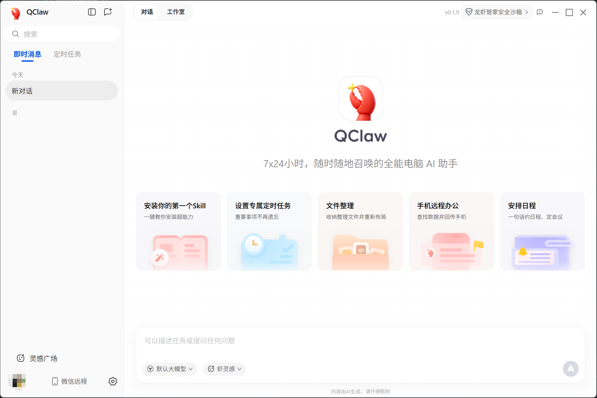

# [QClaw](https://claw.guanjia.qq.com/) Skip Invite

跳过 QClaw 应用的邀请码验证，去除启动时的邀请码弹窗。

## 效果

<!-- 把截图放到 assets 目录下 -->


## 使用

```bash
npx qclaw-skip-invite
```

完成后重启 QClaw 即可。

## 还原

```bash
APP_ASAR="/Applications/QClaw.app/Contents/Resources/app.asar"
cp "$APP_ASAR.bak" "$APP_ASAR"
```
